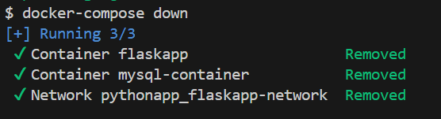

## This project demonstrate use of following docker concepts to host a python application using mysql database.

**Docker concepts used :**
* Docker Volumes
* Docker Network
* Use of environment variables into my Docker compose file

**How to run this project ?**
`cd pythonapp`
`docker-compose up -d`

**Check if flask-app container is able to connect to mysql-container**
`docker exec -it flaskapp mysql -h mysql-container -u admin -p`

**Cleanup the container from compose file** 
`docker compose down`  _#!Removes docker containers, networks from compose file_

`docker compose down --rmi all -v`  _#!Removes docker images, networks, volumes from compose file_

